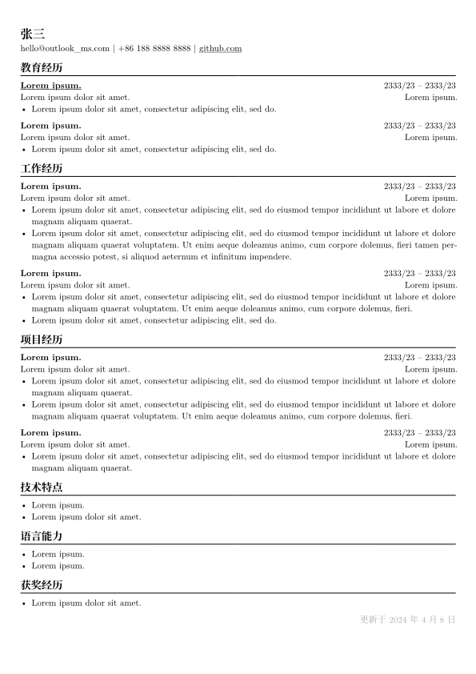

## Project Structure

- **cv.typ**: CV content source file.
- **meta.typ**: Template code for the CV.
- **justfile**: Build recipe file.

## Key Features

- [x] Supports both Chinese and English in a single file (defaults to Chinese).
- [x] Allows selective section hiding for streamlined output (default: all sections visible).

## PDF Generation Instructions

1. **Using Typst Web Application**:
   - Upload `cv.typ` and `meta.typ` files to [Typst](https://typst.app/) and utilize the web interface for generation.

2. **Using Just Command-Line Tool** ([Just](https://github.com/casey/just)):
   - **Options**:
     - `la`: Language choice between Chinese (`zh`) and English (`en`).
     - `output`: Choose between `concise` or `full` output modes.
   - **Examples**:
     - `just`: Generates a concise PDF in Chinese.
     - `just compile-all`: Produces all PDF variations.
     - `just compile en full`: Outputs a full English PDF.

3. **Using Bash**:
   ```bash
   echo '#let render_mode = (la: "zh", output: "concise")' > f.typ && sed 1d cv.typ >> f.typ && typst compile f.typ cv.pdf && rm f.typ
   ```

## Preview



## Additional References

- [Typst Documentation](https://typst.app/docs/)
  - [Conditional Rendering](https://typst.app/docs/tutorials/conditional-rendering)

## FAQ

- Why font seems not work? A: check with `typst fonts`. 