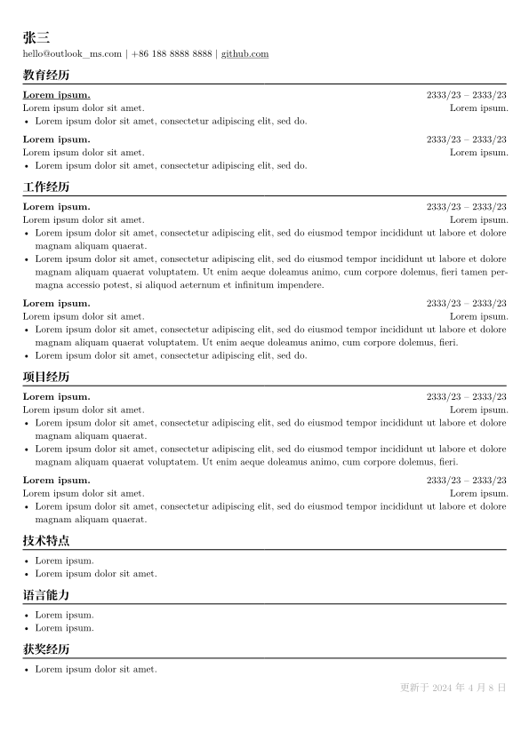

## Project Structure

- **cv.typ**: Main CV document template.
- **meta.typ**: Utility functions for dates.
- **data-zh.yaml**: Chinese CV content.
- **data-en.yaml**: English CV content.
- **justfile**: Build recipes.

## Key Features

- [x] Multi-language support (Chinese `zh` and English `en`).
- [x] YAML-driven section configuration — add, hide, or reorder sections without touching code.
- [x] Concise and full output modes.

## Build Commands

Requires [Just](https://github.com/casey/just) and [Typst](https://typst.app/).

### Quick Commands

```bash
just              # Default: Chinese concise
just zh           # Chinese concise
just zh-full      # Chinese full
just en           # English concise
just en-full      # English full
just all          # All variants
just clean        # Clean generated PDFs
just fonts        # Check available fonts
```

### Flexible Build

```bash
just compile <lang> <mode>
```

- `lang`: `zh` or `en`
- `mode`: `concise` or `full`

Example: `just compile en full`

### Without Just

```bash
typst compile --input la=zh --input output=concise cv.typ cv.pdf
```

## Preview



## Additional References

- [Typst Documentation](https://typst.app/docs/)
  - [Conditional Rendering](https://typst.app/docs/tutorials/conditional-rendering)

## FAQ

- **Font not working?** Run `just fonts` or `typst fonts` to check available fonts. 